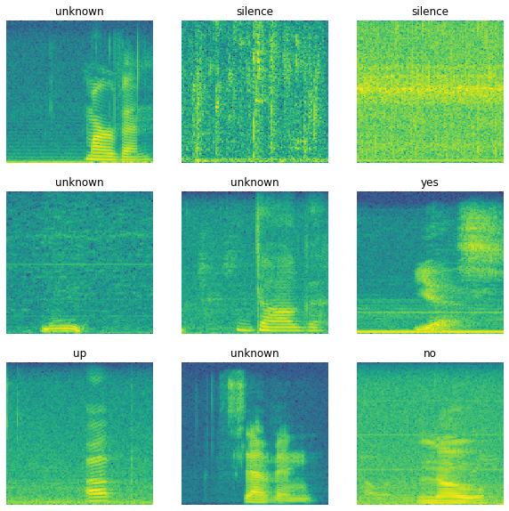

# Kaggle: TensorFlow Speech Recognition Challenge

Data: 65 000 one-second clips of voice commands

Task: classify each clip to one of 12 categories

Evaluation: multiclass accuracy

Solution: 2D-CNN with spectograms as inputs

Success: 0.81 multiclass accuracy

